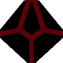

	 

# NoDice2

*基于[ nonebot2 ](https://github.com/nonebot/nonebot2)以及[ go-cqhttp ](https://github.com/Mrs4s/go-cqhttp)的QQ跑团掷骰机器人*

### Features

**以下功能排列不分优先级：**

- [ ] 帮助文档 `.help`
- [x] 规则速查 `.rules`
  
#### 娱乐功能

- [x] 今日人品 `.jrrp`

#### 机器人管理模块

- [ ] 发送消息 `.send`
- [ ] 骰主绑定 `.master`
- [ ] 全局管理 `.admin`
- [ ] 自定义帮助词条 `.helpdoc`
- [x] 自定义回执文本 `.setstr`

#### 掷骰模块（核心）

- [x] 标准掷骰 `.r(h) 4#3d6k2+5 reason`
- [x] 设置默认骰 `.set`
- [x] COC 检定 `.ra`
- [x] COC 房规 `.setcoc`
- [ ] DND 先攻 `.ri` 
- [ ] 先攻列表 `.init`
- [ ] FATE 掷骰 `.rf`
- [ ] WOD 骰池 `.w(w)`
- [x] COC 理智检定 `.sc`
- [x] COC 成长检定 `.en`
- [x] COC 奖惩骰 `.rb/p`

#### 牌堆模块

- [x] 拓展牌堆 `.draw` 
- [ ] 分群牌堆 `.deck`
- [x] 疯狂症状 `.ti/li`
- [x] 随机姓名 `.name`

#### 人物模块

- [x] 人物作成 `.coc/dnd`
- [ ] 角色卡 `.pc`
- [ ] 角色卡设置 `.pc`
- [x] 设置昵称 `.nn(n)`

#### 群管模块

- [ ] 骰子开关 `.bot on/off`
- [ ] 退群指令  `.dismiss`
- [ ] 欢迎词 `.welcome`
- [ ] 群管理操作 `.group `
- [ ] 跑团记录 `.log`
- [ ] 旁观者模式 `.ob`

### Developer

[开发文档](./docs/DEVELOPER.md)

### License

[AGPL-3.0 License](LICENSE)

### Thanks

- [w4123](https://github.com/w4123) ，Dice! 的主要开发者与 Dice3 的开发者。
- [mystringEmpty](https://github.com/mystringEmpty) Dice! 的另一名主要开发者。

### Nothing useful

本项目旨在用 python 移植 CQ原生插件 Dice! ~~（虽然本项目的架构更像是 Dice3）~~。

之所以取名 NoDice ，是因为一开始只是想要把 Dice的感叹号移到前面来，也就是 NotDice ，刚好可以把组织名取作 `this is not dice` 来玩双关。接着因为本项目基于 nonebot 框架，就想取个相近的名字，而 not 和 none 就只有 no 这两个字相同了，组织名刚好也能玩双关，只是意思从“这不是骰子”变成了“这里没有骰子”~~（当然我更喜欢翻译为无骰骑士异闻录）~~。