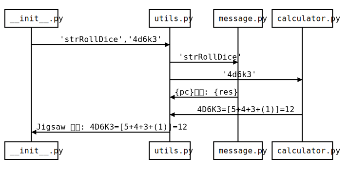

### TO DO List

- `.admin update` `.admin reload`
- `.r`
- `.bot on/off` `.dismiss`

*前期将会专注于迁移 nodice1 已经写好的功能，所以原意帮忙的话可以去康康 group.py 和 logger.py*

### 简单的架构说明

以掷骰命令 `.r4d6k3` 为例，nonebot2 框架接收到 go-cqhttp 传来的消息，将 `.r4d6k3` 传递给 NoDice 插件。

接着 \_\_init\_\_.py 识别到 `.r` 为 roll_dice 命令 ，将 'strRollDice' 和截取后的表达式传给 utils.py 。

utils.py 分别将两项参数传递给 message.py 和 calculator.py ，再将结果整合传回 \_\_init\_\_.py 。

NoDice 插件再将消息原路返回。

### 各模块功能说明

#### calculator.py

计算/掷骰核心,由可以进行标准掷骰的基类 `BaseCalculator`  继承出 `CocCalculator` `FateCalculaotr` `WodCalculator` 等派生类,是所有掷骰相关功能的核心。 

**相关功能:**

- [ ] 标准掷骰 `.r(h) 4#3d6k2+5 reason`
- [ ] 设置默认骰 `.set`
- [ ] COC 检定 `.ra(h)`
- [ ] COC 房规 `.setcoc`
- [ ] DND 先攻 `.ri` 
- [ ] 先攻列表 `.init`
- [ ] FATE 掷骰 `.rf`
- [ ] WOD 骰池 `.w(w)`
- [ ] COC 理智检定 `.sc`
- [ ] COC 成长检定 `.en`
- [ ] COC 奖惩骰 `.rb/p`

#### deck.py

牌堆核心,将重构为Deck类,负责读取 `decks` 目录下的所有json文件和yml文件，并存入内存当中。（在nodice1时期每抽取一次牌堆都会读取一次所有牌堆，这对于效率是一个很大的问题。本版本将修复此问题，作为代价每次加了新牌堆都必须手动更新。）

**相关功能:**

- [ ] 拓展牌堆 `.draw` 
- [ ] 分群牌堆 `.deck`
- [ ] 疯狂抽取 `.ti/li`
- [ ] 随机姓名 `.name`

#### character.py

负责管理角色卡与人物作成，顺便把人物做成和人物卡设置对接到一起以便自动生成可调用的人物卡。

- [ ] 人物作成 `.coc/dnd`
- [ ] 角色卡 `.pc`
- [ ] 角色卡设置 `.st`
- [ ] 设置昵称 `.nn(n)`

#### group.py

群管模块，开关、欢迎词、群管操作，跟QQ群有较大关系的功能都会丢到这里。

- [ ] 骰子开关 `.bot on/off`
- [ ] 退群指令  `.dismiss`
- [ ] 欢迎词 `.welcome`
- [ ] 群管理操作 `.group `
- [ ] 旁观者模式 `.ob`

#### admin.py

骰主管理模式，要注意的是Nonebot自身有一个SUPERUSER权限，但它的权限在这里是没有用处的，你必须手动认主才能使骰娘正常工作。

*nodice1的bot_control也被合并到了该模块。*

- [ ] 骰主绑定 `.master`
- [ ] 全局管理 `.admin`

#### logger.py

本属于TRPGlogger的功能，被我也整合进了nodice里，同时支持自动格式处理以适配[ auto_video ](https://github.com/jigsaw111/auto_video)。

- [ ] 跑团记录 `.log`

#### help.py

帮助功能信息，基本都是写死的字符串。

- [ ] 帮助文档 `.help`
- [ ] 自定义帮助词条 `.helpdoc`
- [ ] 自定义回执文本 `.str`

#### others.py

不知道该往哪分类的神奇功能，就都丢到这个模块了。后面两个功能可以选择本地或者调用溯洄的API（默认使用本地服务）。

- [ ] 第三人称动作 `.me`
- [ ] 发送消息 `.send`
- [ ] 今日人品 `.jrrp`
- [ ] 规则速查 `.rules`

#### sqlite.py  

链接sqlite3数据库，所有需要数据库的操作都通过此模块进行。

#### utils.py  

工具模块，负责给__init__.py提供接口以便调用其他函数。

#### \_\_init\_\_.py  

主模块，所有命令都写在这里。

#### lua.py  

Dice! 2.5 整出来的新活，看心情复刻。

### Notes